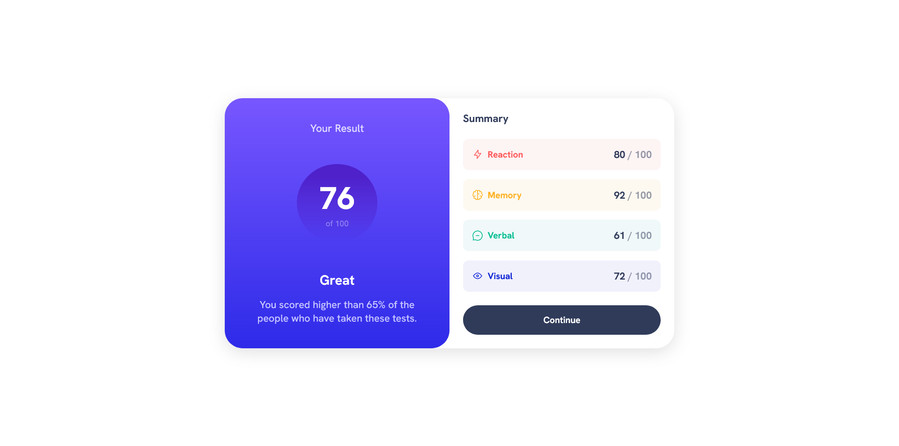
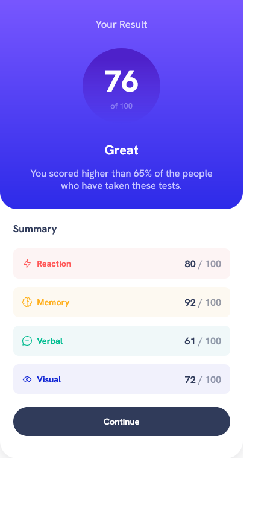

# Frontend Mentor - Results summary component solution

This is a solution to the [Results summary component challenge on Frontend Mentor](https://www.frontendmentor.io/challenges/results-summary-component-CE_K6s0maV). Frontend Mentor challenges help you improve your coding skills by building realistic projects. 

## Table of contents

- [Overview](#overview)
  - [The challenge](#the-challenge)
  - [Screenshots](#screenshots)
  - [Links](#links)
- [My process](#my-process)
  - [Built with](#built-with)
  - [What I learned](#what-i-learned)
  - [Continued development](#continued-development)
  - [Useful resources](#useful-resources)
- [Author](#author)

## Overview

### The challenge

Users should be able to:

- View the optimal layout for the interface depending on their device's screen size
- See hover and focus states for all interactive elements on the page

### Screenshots

### Links

- Solution URL: [GitHub](https://github.com/Yazeed-Idris/results-summary-component)
- Live Site URL: [GitHub Pages](https://yazeed-idris.github.io/results-summary-component/)

## My process

### Built with

- [HTML5 markup](https://developer.mozilla.org/en-US/docs/Web/Guide/HTML/HTML5)
- [CSS custom properties](https://developer.mozilla.org/en-US/docs/Web/CSS/--*)

### What I learned

The tricky part of this challenge was nailing down the gradient color for the circle.

### Continued development

This component can be used to display the results of a quiz or a test. I would like to use this component in a future project.

### Useful resources

- [W3Schools](https://www.w3schools.com/) - This site is the goto when it comes to making responsive designs.
## Author

- Github - [@Yazeed-Idris](https://github.com/Yazeed-Idris)
- Frontend Mentor - [@Yazeed-Idris](https://www.frontendmentor.io/profile/Yazeed-Idris)
- LinkedIn - [@Yazeed Idris](https://www.linkedin.com/in/yazeed-idris/)

